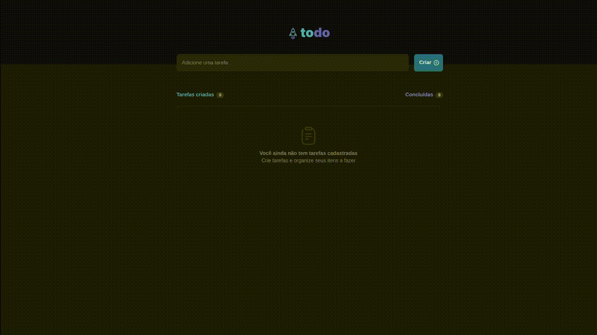

# Todo List

A task management application that allows users to add new tasks, mark them as complete, and easily delete them. Perfect for managing daily activities simply and efficiently.

## 🔨 Features

- [x] Add new task
- [x] Delete task
- [x] Mark task as completed

## 🧪 Tools

- [React](https://react.dev/)
- [Vite](https://vitejs.dev/)
- [TypeScript](https://www.typescriptlang.org/)

## 🚀 Deploy

You can access the project through [this link](https://todolist-palomarodrigues.vercel.app/)

---

Developed with 💜 by <a href="https://www.linkedin.com/in/palomarodrigs" target="_blank">Paloma Rodrigues</a>

